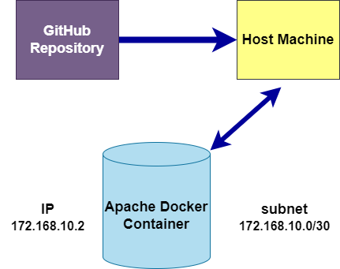

# Docker Ansible Deployment

This repository contains an Ansible playbook for deploying Docker containers running Apache service with a static web page. The playbook sets up networking and verifies accessibility from the host machine.

## Instructions

1. Ensure Docker and Ansible are installed on your machines.
2. Clone this repository.
3. Run the Ansible playbook `docker_deploy.yml`.

## Network Diagram

## Requirements

- Docker installed on the target machine(s)
- Ansible installed on the control machine
